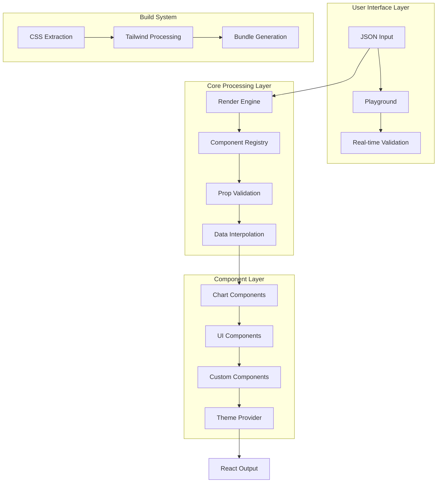

# Architecture Overview 🏗️

This document provides a comprehensive overview of the JSON UI/Graphics Generator architecture, covering all system components, data flow, and technical implementation details.

## System Architecture



## Core Components

### 1. Render Engine 🚀
**Location**: `components/render-engine/render-engine.tsx`

The render engine is the heart of the system, responsible for converting JSON configurations into React components.

#### Key Features:
- **JSON-to-React Conversion**: Transforms JSON structure into React component tree
- **Data Interpolation**: Processes `{{}}` syntax for dynamic content
- **SVG Support**: Native SVG rendering with animations
- **Error Handling**: Graceful degradation for invalid components
- **Performance Optimization**: Recursive rendering with depth tracking

#### Process Flow:
1. **Input Validation**: Validates JSON structure and required fields
2. **Style Injection**: Injects CSS styles into document head
3. **Element Processing**: Recursively processes each element
4. **Component Resolution**: Maps component names to React components
5. **Prop Validation**: Validates and processes component props
6. **Data Binding**: Injects layout data into props
7. **React Rendering**: Returns rendered React component tree

#### Code Example:
```typescript
// Basic render engine usage
const layout: RenderLayout = {
  id: "example",
  root: {
    type: "Card",
    props: { className: "p-4" },
    children: [{ text: "Hello World" }]
  }
}

<RenderEngine layout={layout} />
```

### 2. Component Registry 📚
**Location**: `components/render-engine/component-registry.tsx`

The component registry manages all available components and their configurations.

#### Registry Categories:
- **Core UI Components**: Button, Card, Badge, etc.
- **Form Components**: Select, Input, Checkbox, etc.
- **Chart Components**: Bar, Line, Pie, Radar, Radial
- **Animation Components**: Framer Motion components
- **Custom Components**: Project-specific components

#### Registration Pattern:
```typescript
export const componentRegistry: Record<string, React.ComponentType<any>> = {
  Button: Button,
  Card: Card,
  ChartBarDefault: ChartBarDefault,
  // ... more components
}
```

#### Prop Validation:
```typescript
export const componentPropSchemas: Record<string, any> = {
  Button: {
    variant: ["default", "destructive", "outline", "secondary"],
    size: ["default", "sm", "lg", "icon"],
    disabled: "boolean",
  },
  // ... more schemas
}
```

### 3. Type System 🎯
**Location**: `types/render-schema.ts`

Comprehensive TypeScript definitions for all JSON structure elements.

#### Core Types:
- **RenderLayout**: Root configuration object
- **RenderElement**: Union type for all element types
- **ComponentElement**: shadcn/ui components
- **SvgElement**: SVG graphics support
- **TagElement**: HTML tags
- **TextElement**: Text content
- **IconElement**: Icon components

#### Type Hierarchy:
```typescript
interface RenderLayout {
  id: string
  title?: string
  description?: string
  data?: Record<string, any>
  theme?: Record<string, string>
  styles?: string
  root: RenderElement
}

type RenderElement = 
  | ComponentElement
  | TagElement
  | TextElement
  | IconElement
  | SvgElement
  | StyleElement
```

### 4. Template System 📄
**Location**: `lib/` directory

Pre-built JSON templates for different chart types and UI components.

#### Template Categories:
- **Area Charts**: `area-chart-templates.ts`
- **Bar Charts**: `bar-chart-templates.ts`
- **Line Charts**: `line-chart-templates.ts`
- **Pie Charts**: `pie-chart-templates.ts`
- **Radar Charts**: `radar-chart-templates.ts`
- **Radial Charts**: `radial-chart-templates.ts`
- **Metric Cards**: `metric-card-templates.ts`
- **UI Templates**: `ui-templates.ts`

#### Template Structure:
```typescript
export const exampleTemplate: RenderLayout = {
  id: "unique-identifier",
  title: "Display Name",
  description: "Template description",
  data: {
    // Sample data for the template
  },
  root: {
    // Component structure
  }
}
```

### 5. Theme System 🎨
**Location**: `components/theme/`

Complete theme system with dark/light mode support.

#### Components:
- **ThemeProvider**: Context provider for theme state
- **ThemeToggle**: UI component for theme switching
- **CSS Variables**: Theme-aware color system

#### Theme Integration:
```typescript
// Theme-aware colors
const colors = {
  primary: "hsl(var(--primary))",
  secondary: "hsl(var(--secondary))",
  background: "hsl(var(--background))",
  foreground: "hsl(var(--foreground))"
}
```

### 6. CSS Extraction System 🎨
**Location**: `scripts/extract-template-classes.js`

Build-time CSS class extraction for Tailwind CSS optimization.

#### Process:
1. **Template Scanning**: Recursively scans all template files
2. **Class Extraction**: Extracts CSS classes from JSON configurations
3. **Deduplication**: Removes duplicate classes
4. **File Generation**: Creates `generated/template-classes.js`
5. **Tailwind Integration**: Ensures all classes are included in builds

#### Extracted Patterns:
- `className: "..."`
- `"className": "..."`
- `class: "..."`
- Template variables are excluded

## Data Flow Architecture

### 1. Input Processing
```
JSON Input → Validation → Parsing → Structure Creation
```

### 2. Rendering Pipeline
```
RenderLayout → Element Processing → Component Resolution → Prop Validation → Data Injection → React Rendering
```

### 3. Data Interpolation
```
Template Data → {{}} Processing → Nested Value Resolution → Prop Injection
```

### 4. Theme Processing
```
Theme Context → CSS Variables → Component Styling → Dynamic Updates
```

## Chart System Architecture

### Chart Component Hierarchy
```
ChartContainer (Base)
├── ChartTooltip
├── ChartLegend
├── Chart Types
│   ├── AreaChart
│   ├── BarChart
│   ├── LineChart
│   ├── PieChart
│   ├── RadarChart
│   └── RadialChart
└── Chart Elements
    ├── XAxis / YAxis
    ├── CartesianGrid
    ├── PolarGrid
    └── ResponsiveContainer
```

### Chart Data Flow
```
JSON Data → Chart Configuration → Recharts Components → SVG Output
```

## Performance Architecture

### Optimization Strategies
1. **Recursive Rendering**: Depth-limited processing
2. **Component Memoization**: React.memo for expensive components
3. **CSS Extraction**: Build-time optimization
4. **Bundle Splitting**: Code splitting for chart components
5. **Lazy Loading**: Dynamic component imports

### Memory Management
- **Component Cleanup**: Automatic style cleanup on unmount
- **Event Listeners**: Proper cleanup for interactive components
- **Data References**: Efficient data structure handling

## Security Architecture

### Input Validation
- **JSON Schema**: Structure validation
- **Prop Sanitization**: XSS prevention
- **Component Whitelisting**: Only registered components allowed

### Security Measures
- **No Eval**: No dynamic code execution
- **Sanitized Props**: HTML content sanitization
- **Type Safety**: TypeScript type checking

## Build System Architecture

### Build Process
```
Source Code → TypeScript Compilation → CSS Extraction → Next.js Build → Static Generation
```

### CSS Extraction Workflow
```
Template Files → Pattern Matching → Class Extraction → File Generation → Tailwind Processing
```

### Production Optimizations
- **Static Site Generation**: Pre-built pages
- **Image Optimization**: Next.js image optimization
- **Bundle Analysis**: Webpack bundle analyzer
- **Code Splitting**: Route-based splitting

## Testing Architecture

### Testing Layers
1. **Unit Tests**: Individual component testing
2. **Integration Tests**: Component interaction testing
3. **Visual Tests**: Screenshot comparison
4. **Performance Tests**: Rendering performance

### Test Structure
```
/__tests__/
├── components/
├── lib/
├── types/
└── integration/
```

## Deployment Architecture

### Environment Configuration
- **Development**: Hot reloading, source maps
- **Staging**: Production-like environment
- **Production**: Optimized builds, CDN integration

### Deployment Flow
```
Code Changes → Build Process → Testing → Deployment → Monitoring
```

## Monitoring & Analytics

### Performance Metrics
- **Rendering Time**: Component rendering performance
- **Bundle Size**: JavaScript bundle analysis
- **Memory Usage**: Runtime memory monitoring
- **Error Rates**: Error tracking and reporting

### Analytics Integration
- **Usage Tracking**: Component usage analytics
- **Performance Monitoring**: Real-time performance metrics
- **Error Reporting**: Automated error reporting

## Future Architecture Considerations

### Planned Enhancements
1. **Plugin System**: Extensible architecture for custom components
2. **State Management**: Redux/Zustand integration
3. **Server-Side Rendering**: Enhanced SSR support
4. **WebAssembly**: Performance-critical operations
5. **Micro-frontends**: Modular deployment architecture

### Scalability Improvements
- **Component Virtualization**: Large dataset handling
- **Streaming**: Progressive rendering
- **Caching**: Intelligent component caching
- **CDN Integration**: Global content distribution

## Technical Debt

### Known Issues
1. **Type Safety**: Limited runtime type checking
2. **Error Boundaries**: Insufficient error handling
3. **Performance**: No virtualization for large datasets
4. **Testing**: Limited test coverage
5. **Documentation**: API reference incomplete

### Improvement Priorities
1. **Security**: Input validation and sanitization
2. **Performance**: Virtualization and optimization
3. **Testing**: Comprehensive test coverage
4. **Documentation**: Complete API documentation
5. **Monitoring**: Performance and error tracking 